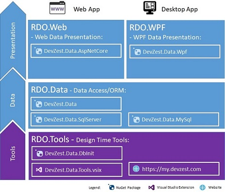
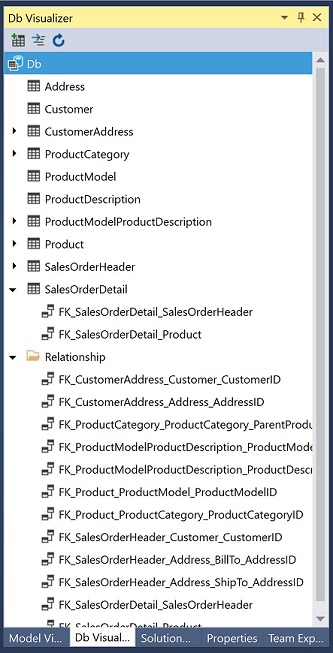

# Welcome to RDO.Net

Relational Data Objects .Net (RDO.Net) is a framework to develop enterprise application in .Net platform, targeting .Net developers. Enterprise application, typically backed by a relational database, has decades of history. Many frameworks exist to help developing these applications easier. However, none of them ideal:

* [Object-Relational Mapping (ORM, O/RM, and O/R mapping tool)](https://en.wikipedia.org/wiki/Object-relational_mapping), as the core of enterprise applications, is still [The Vietnam of Computer Science](http://blogs.tedneward.com/post/the-vietnam-of-computer-science/). Particularly, these difficulties are referred to as the [object-relational impedance mismatch](https://en.wikipedia.org/wiki/Object-relational_impedance_mismatch).
* Database testing, still stays on principles and guidelines. No widely practical use yet. Refactoring an enterprise
application is error prone due to lack of database testing.
* Separation of the graphical user interface from the business logic or back-end logic (the data model), is still a challenge task. Frameworks such as [MVVM](https://en.wikipedia.org/wiki/Model%E2%80%93view%E2%80%93viewmodel) exists, but it's far from ideal: it will hit the wall when dealing with complex layout or complex interactivity; refactoring UI logic is error prone, etc.

The above challenges impose great burdens for developing and further changing an enterprise application. RDO.Net, designed and developed as an integral, end to end solution, is here to be the rescue.

## Overview

RDO.Net consists of libraries and tools for .Net developers:



## Highlights

* You can develop your application 100% strongly typed from database to GUI, with extremely clean code in C# or VB.Net.
* You don't need Entity Framework or other ORM component any more, you write SQL in C#/VB.Net explicitly, without any hidden magic. You will get stored procedure equivalent SQL and performance without losing the power of C#/VB.Net/Visual Studio.
* For WPF application development, no need for any complex control such as ListBox, TreeView, DataGrid nor any 3rd party framework. RDO.WPF provides a one-for-all data presenter to handle layout, data binding, data validation, in a simple and intuitive way.
* JSON serialization/deserialization is a first class citizen, no need for any other JSON library. Unbeatable performance because no reflection involved during serialization/deserialization.
* Database testing and deployment is a first class citizen. You can easily mock part of database with testing data, generate database from clean C#/VB.Net code, or generate C#/VB.Net code from table data in database, right in Visual Studio.
* And much more with a very small yet flexible runtime - you only need to add several dlls into your application, sized from tens to hundreds of KBs!

## A Taste of RDO.Net

### The Model

[!code-csharp[SalesOrderDetail](../../samples/AdventureWorksLT.Data.SqlServer.CSharp/AdventureWorksLT.Data/SalesOrderDetail.cs)]

The code of model can be manipulated in Model Visualizer tool window in Visual Studio:


### The Database

[!code-csharp[Db](../../samples/AdventureWorksLT.Data.SqlServer.CSharp/AdventureWorksLT.Data/Db.cs)]

The code of database can be manipulated via Db Visualizer tool window in Visual Studio:



### Data Access (CRUD)

[!code-csharp[Db](../../samples/AdventureWorksLT.Data.SqlServer.CSharp/AdventureWorksLT.Data/Db.Api.cs#SalesOrderCRUD)]

### Data Presentation

[!code-csharp[Db](../../samples/AdventureWorksLT.WpfApp/SalesOrderWindow.DetailPresenter.cs)]

This will produce the following data grid UI, with foreign key lookup and paste append from clipboard:


### Mock Database for Testing

```csharp
public sealed class MockSalesOrder : DbMock<Db>
{
    public static Task<Db> CreateAsync(Db db, IProgress<DbInitProgress> progress = null, CancellationToken ct = default(CancellationToken))
    {
        return new MockSalesOrder().MockAsync(db, progress, ct);
    }

    // This method is generated by a tool
    private static DataSet<SalesOrderHeader> Headers()
    {
        DataSet<SalesOrderHeader> result = DataSet<SalesOrderHeader>.Create().AddRows(4);
        SalesOrderHeader _ = result._;
        _.SuspendIdentity();
        _.SalesOrderID[0] = 1;
        _.SalesOrderID[1] = 2;
        ...
        _.ResumeIdentity();
        return result;
    }

    // This method is generated by a tool
    private static DataSet<SalesOrderDetail> Details()
    {
        DataSet<SalesOrderDetail> result = DataSet<SalesOrderDetail>.Create().AddRows(32);
        SalesOrderDetail _ = result._;
        _.SuspendIdentity();
        ...
        _.SalesOrderDetailID[0] = 1;
        _.SalesOrderDetailID[1] = 2;
        ...
        _.ResumeIdentity();
        return result;
    }

    protected override void Initialize()
    {
        // The order of mocking table does not matter, the dependencies will be sorted out automatically.
        Mock(Db.SalesOrderDetail, Details);
        Mock(Db.SalesOrderHeader, Headers);
    }
}
```

The code for testing data is generated from database:


